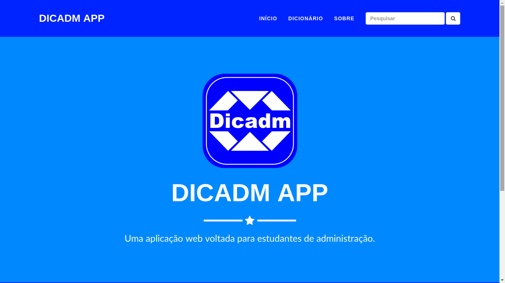
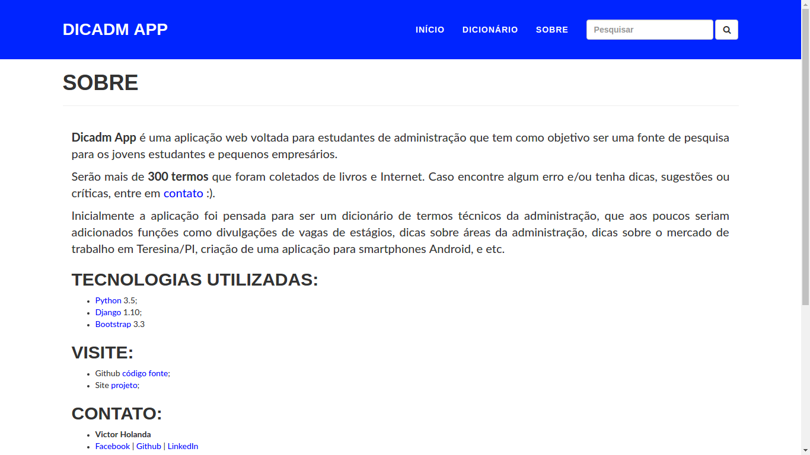
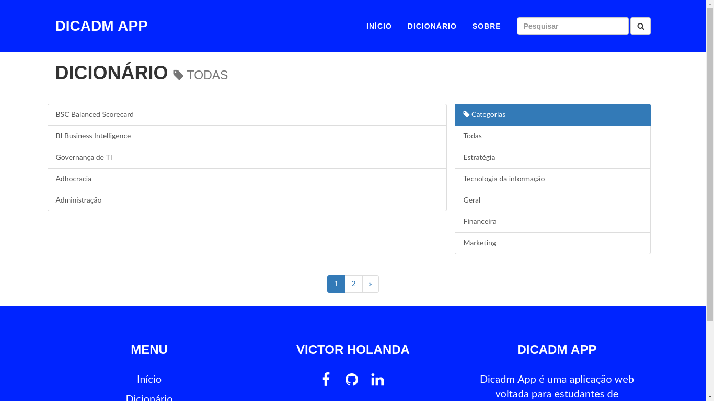

# Dicadm App

## Introdução

**Dicadm App** é uma aplicação web voltada para estudantes de administração que tem como objetivo ser uma fonte de pesquisa para os jovens estudantes e pequenos empresários.
Serão mais de **300 termos** que foram coletados de livros e Internet. Caso encontre algum erro e/ou tenha dicas, sugestões ou críticas, entre em contato :).
Inicialmente a aplicação foi pensada para ser um dicionário de termos técnicos da administração, que aos poucos seriam adicionados funções como divulgações de vagas de estágios, dicas sobre áreas da administração, dicas sobre o mercado de trabalho em Teresina/PI, criação de uma aplicação para smartphones Android, e etc.

## Imagens:

## Tecnologias utilizadas:

* [Python](https://www.python.org/) 3.5
* [Django](https://www.djangoproject.com/) 1.10
* [Bootstrap](http://getbootstrap.com/) 3.3

## Outros requisitos:

* [model-mommy](https://pypi.python.org/pypi/model_mommy) 1.2.6
* [six](https://pypi.python.org/pypi/six) 1.10.0
* [whitenoise](https://pypi.python.org/pypi/whitenoise)

Antes de testar, execute no terminal para instalar as dependências:

`pip install -r requirements.txt`

## Visite:

* Github [código fonte](https://github.com/VictorHolanda21/dicadm_django);
* Site [projeto](https://victorholanda21.pythonanywhere.com/)

## Etapas do projeto:

- [x] Início: primeiras views e rotas
- [x] App Dictionary
- [x] Refatorar código, tema
- [x] Pesquisa de termos
- [x] Paginação de resultados
- [x] Refatorar código, tema (2)
- [ ] Acesso de usuários
- [ ] Adicionar função "gostei"
- [ ] Api para aplicativo mobile
- [ ] Adicionar função "favoritos"
